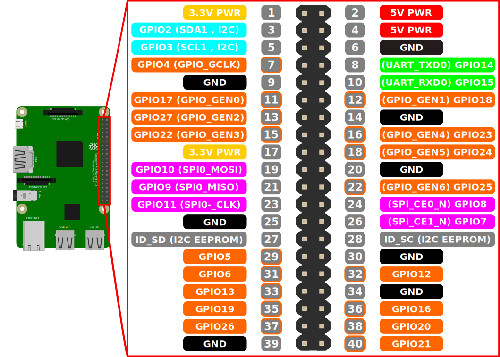
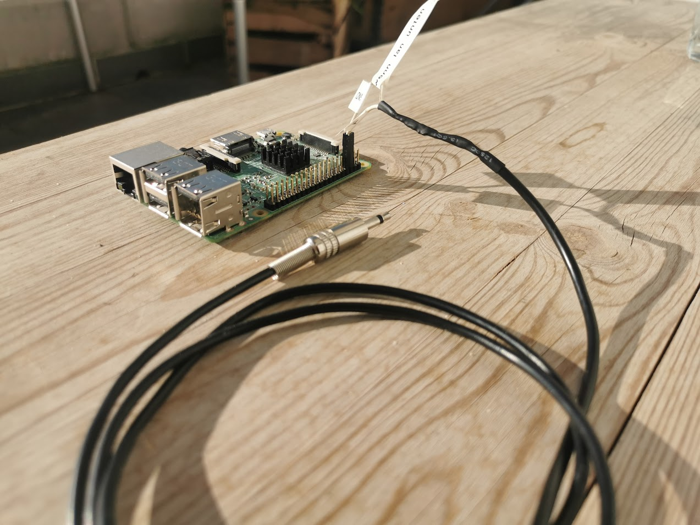

# Objective 
Control Onkyo Hardware with RI Jack with NodeRed & Rasperry Pi
# TLDR
U need to **bulild a cable** youslelf with a **3.5mm mono jack**, that has a **10kOhms resistor** in parallell, and connect the other end to a Rasperry Pi's GPIOS

# Getting started
**node-red-contrib-onkyo-ri** wrapps [dajuly0x23/onkyo-rpi](https://github.com/dajuly20/Onkyo-RI-Rasperrypi) 
(written in C++ using Wiring Pi) for Node-Red on a Rasperry Pi

The node calls the script and passes ```msg.payload``` to it. So (according to the table below) ```msg.payload``` could be 0x20 to switch a connected Onkyo Ri device to CD Input.
You can also send multiple commands, seperated by commas like ```0x20,0x20,0x20```. 

# Before you start
Codes don't seem to be super-similar between different models. There **are** codes documented, but if you don't have a model, that's in the list, 
you need to use a scan script like in [ahaack/onkyo-RPI](https://github.com/ahaack/onkyo-RPI) ***scan** script, and determine the (missing) commands to your hardware yourself 
Please consider adding your device to the list here then. Pull request welcome! 
Creating a C++ implementation and adding a NodeRed wrapper for it is planned for the near future. 

# Installation
The dependency comes pre compiled and should just run fine out of the box. 
Test by executing. ```./Onkyo-RI-Rasperrypi/onkyoricli```

If it fails, maybe you have to recompile it. See docs for [dajuly0x23/onkyo-rpi](https://github.com/dajuly20/Onkyo-RI-Rasperrypi) for instructions. 


To test if all works execute
```
cd Onkyo-RI-Rasperrypi
./onkyoricli -p <wiringPi port> -c 0x20
```
The graphic below shows the port numbers for a rasperry pi 3.
If you connected the cable as suggested below use ```25```
If you have another model then look for WiringPi pin numbers rasperry pi xxx. 


If the cabe is connected, and you got a right code, you should see / hear some reacrion from your Hardware now! 

## Connection
To connect to the RI port a 3.5mm mono jack is used. Tip is for data signal and sleeve is ground (GND). In case of stereo jack, connect tip to DATA, sleeve **and** ring to GND. That means for a Rasperry Pi 3 to put the tip to Pin 22 (GPIO_GEN6) GPIO25 (tx) (which is set as Standart for this node) and the shield to Pin 20 or another ground (Gnd). Please note, the pins can't be connected to UART ( Pin 8 / 9 ). (I didn't try it, so correct me if im worng).
If you want to use another GPIO, you can specify that later in node red. The connection schema shown below is for a Rasperry Pi 3. 
If you have Wiring Pi installed you can use ```gpio readall``` 




This is the cable I made. The part close to the pi contains my 10k resistor, which my past-me seemed to have soldered in correctly - yet it seemed to work. (In the picture it is connected to UART Pins - which is wrong as I guess. 8 =>  22 ( GPIO25 ) and ground could make its shorter path 6 => 20.


## RI codes.
### [RI Codes on seperate page](./Codes/RiCodes.md)
##

## Further reading 

## Protocol
Protocol description could be found at:
*    http://lirc.sourceforge.net/remotes/onkyo/Remote_Interactive

or with grafical representation at:
*    http://fredboboss.free.fr/articles/onkyo_ri.php .

#### Notes on volume (as per [ahaack/onkyo-rpi](https://github.com/ahaack/onkyo-rpi))
Volume control codes shown in the table are sent by the receiver out of its RI ports when adjusting the volume using a remote control (they can be found using an oscilloscope).
However, the receiver will not react to these codes when they are sent from an external device, effectively making impossible to control its volume through RI signals.

**Comment to that by Julian Wiche**:

That doesn't seem to be true on every device. I **could** contol the volume on my TX SR 605 when input is set to Game/TV. 
The scan program (see further up) can be used to obtain the codes - it only requires a "bit" of parience. I think that receivers, that have a motor to turn the knob won't work. 

## Test program
If none of the abouve codes works for you. You can walk through any possible code with the test program. See: [ahaack/onkyo-RPI](https://github.com/ahaack/onkyo-RPI) 
It serves for check all codes (0x000 - 0xFFF) on the target device in a 500ms interval. 

NOTE: As per my personal experience: For me testing went thought a testing mode, that made a loud sinus tone.. also it could increase the volume before.. so be careful not to wake anyone when you try this at nights :D 

## Feel free to Contribute 
If it's just Ri Codes for your Hardware by sending a merge request or write me an email. 
if you fork the whole thing and make it your own project. Please share your findings! Before you fork though, you can send me a message - I 've seen it often enough to have the same project in 100 different forks / versions on npm / Node Red. Think of DAUs. They won't know which version to install.  
